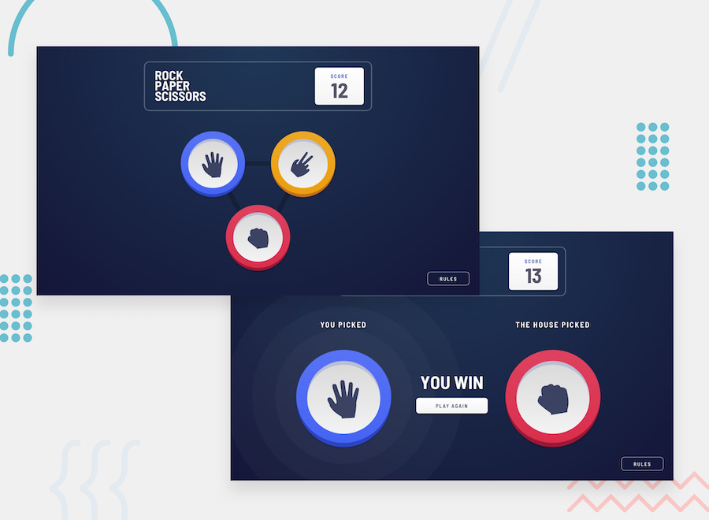

# Frontend Mentor - Rock, Paper, Scissors

## Welcome! 👋

Thanks for checking out this front-end coding challenge.

[Frontend Mentor](https://www.frontendmentor.io) challenges allow you to improve your skills in a real-life workflow.

**To do this challenge, you need a basic understanding of HTML, CSS and JavaScript.**

## The challenge

Your challenge is to build out this Rock, Paper, Scissors game and get it looking as close to the design as possible.

You can use any tools you like to help you complete the challenge. So if you've got something you'd like to practice, feel free to give it a go.

Your users should be able to:

- View the optimal layout for the game depending on their device's screen size
- Play Rock, Paper, Scissors against the computer
- Maintain the state of the score after refreshing the browser _(optional)_
- **Bonus**: Play Rock, Paper, Scissors, Lizard, Spock against the computer _(optional)_

### Rules

If the player wins, they gain 1 point. If the computer wins, the player loses one point.

#### Original

- Paper beats Rock
- Rock beats Scissors
- Scissors beats Paper

#### Bonus

- Scissors beats Paper
- Paper beats Rock
- Rock beats Lizard
- Lizard beats Spock
- Spock beats Scissors
- Scissors beats Lizard
- Paper beats Spock
- Rock beats Scissors
- Lizard beats Paper
- Spock beats Rock

Not sure what Rock, Paper, Scissors, Lizard, Spock is? [Check out this clip from The Big Bang Theory](https://www.youtube.com/watch?v=iSHPVCBsnLw).

Want some support on the challenge? [Join our Slack community](https://www.frontendmentor.io/slack) and ask questions in the **#help** channel.

## Where to find everything

Your task is to build out the project to the designs inside the `/design` folder. You can either choose the `original` designs for the simpler version or the `bonus` designs for the harder version. You will find both mobile and desktop versions of the design to work to. Each file is also named depending on which step in the game the design is for.

The designs are in JPG static format. This will mean that you'll need to use your best judgment for styles such as `font-size`, `padding` and `margin`. This should help train your eye to perceive differences in spacings and sizes.

If you would like the Sketch file in order to inspect the design in more detail it is available to [purchase here](https://bmc.xyz/l/CYkacn7bV).

You will find all the required assets in the `/images` folder. The assets are already optimized.

There is also a `style-guide.md` file, which contains the information you'll need, such as color palette and fonts.

## Building your project

Practice using version control by creating your own GitHub repository for this challenge. This has the added benefit of being able to publish the site for free on GitHub Pages. Find out more about GitHub Pages here: [https://pages.github.com](https://pages.github.com).

Another great tool you could use to get your website live is [Netlify](https://www.netlify.com). They offer a very simple and intuitive way of deploying a site for free and linking the live version to your Git repository.

Also, you could try building this project in a team. This is a great way to practice collaborative coding.

## Suggested workflow

Feel free to use any workflow that you feel comfortable with. Below is a suggested process, but do not feel like you need to follow these steps:

1. Initialize your project as a public repository on [GitHub](https://github.com/). This will make it easier to share your code with the community if you need some help. If you're not sure how to do this, [have a read through of this Try Git resource](https://try.github.io/).
2. Configure your repository to publish your code to [GitHub Pages](https://pages.github.com) or [Netlify](https://www.netlify.com).
3. Look through the designs to start planning out how you'll tackle the project. This step is crucial to help you think ahead for CSS classes that you could create to make reusable styles.
4. Before adding any styles, structure your content with HTML. Writing your HTML first can help focus your attention on creating well-structured content.
5. Write out the base styles for your project, including general content styles, such as `font-family` and `font-size`.
6. Start adding styles to the top of the page and work down. Only move on to the next section once you're happy you've completed the area you're working on.

## Sharing your solution

There are multiple places you can share your solution:

1. Submit it on the platform so that other users will see your solution on the site. Other users will be able to give you feedback, which could help improve your code for the next project.
2. Share your repository and live URL in the **#finished-projects** channel of the [Slack community](https://www.frontendmentor.io/slack).
3. Tweet [@frontendmentor](https://twitter.com/frontendmentor) and mention **@frontendmentor** including the repo and live URLs in the tweet. We'd love to take a look at what you've built and help share it around.

## Giving feedback

Feedback is always welcome, so if you have any to give on this challenge please email hi[at]frontendmentor[dot]io.

This challenge is completely free. Please share it with anyone who will find it useful for practice.

**Have fun building!** 🚀
